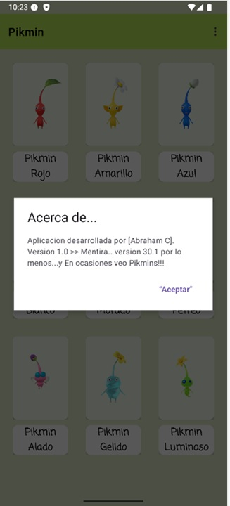
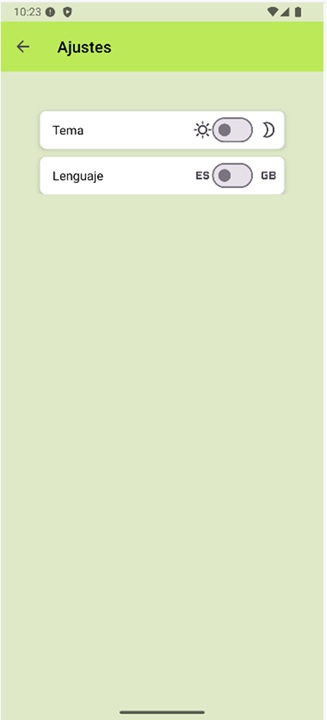
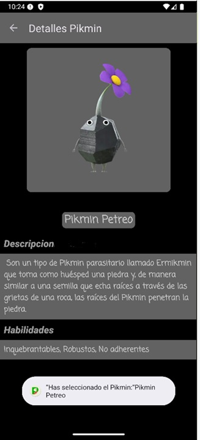
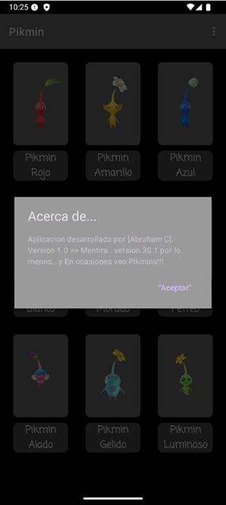
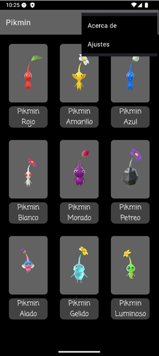

# 🌱 Pikmin App

Aplicación Android que muestra un listado de los 9 tipos de Pikmin en una cuadrícula,  
Implementa un listado interactivo de Pikmin con navegación a detalle,  
soporte multidioma y tema oscuro/claro.

> Desarrollada en Kotlin como tarea del grado de Programación Multimedia Dispositivos Móviles.

---

## 📱 Capturas de pantalla

### Tema Claro

|          Pantalla Principal          |        Pantalla de Detalle         |        Pantalla de Ajustes         |        Diálogo "Acerca de"         |          Pantalla Ajustes          |
|:------------------------------------:|:----------------------------------:|:----------------------------------:|:----------------------------------:|:----------------------------------:|
|  |  |  |  |  |

### Tema Oscuro

|          Pantalla Principal          |        Pantalla de Detalle         |        Pantalla de Ajustes         |        Diálogo "Acerca de"         |          Pantalla Ajustes           |
|:------------------------------------:|:----------------------------------:|:----------------------------------:|:----------------------------------:|:-----------------------------------:|
|  |  |  |  |  |

## ✨ Características principales

### 📋 Listado de Pikmin
- RecyclerView con **GridLayoutManager** de 3 columnas
- **CardView** para cada elemento con imagen y nombre
- Toolbar personalizada con título "Pikmin"

### 📄 Pantalla de detalle
- Imagen grande del Pikmin seleccionado
- Descripción y habilidades completas
- Toolbar con botón de retroceso

### 🎨 Temas y estilos
- Estilos personalizados en `styles.xml`
- Colores, tamaños y fuentes centralizados
- Sin atributos de estilo en layouts XML

### 📱 Menú contextual
- **"Acerca de"**: Diálogo con información de la app
- **"Ajustes"**: Pantalla para cambiar tema claro/oscuro e idioma

### 🌍 Soporte multidioma
- Español (`values/strings.xml`)
- Inglés (`values-en/strings.xml`)

### 💬 Mensajes al usuario
- **Snackbar** al cargar la lista: "¡Bienvenidos al mundo Pikmin!"
- **Toast** al seleccionar un Pikmin: "Se ha seleccionado el Pikmin [nombre]"

### 🚀 Pantalla de inicio (Splash)
- Splash con logo personalizado

---

## 🛠️ Tecnologías utilizadas

- **Kotlin** - Lenguaje de programación
- **Android SDK** - Desarrollo de la app (API 24 - 36)
- **Material Design 3** - Componentes y estilos
- **ViewBinding** - Acceso seguro a vistas
- **RecyclerView** - Listado en cuadrícula con GridLayoutManager
- **CardView** - Tarjetas para cada Pikmin
- **SharedPreferences** - Persistencia de ajustes (tema e idioma)

---

## 📚 Sobre el proyecto

Este proyecto fue desarrollado como parte de mi formación en desarrollo Android.  
Demuestra mis habilidades en:

- **Arquitectura**: Organización en capas (UI, adaptadores, datos)
- **UX/UI**: Material Design, temas, estilos y soporte multidioma
- **Persistencia**: SharedPreferences para guardar preferencias de usuario

### 🎯 ¿Qué he aprendido?

- ✅ Crear interfaces con RecyclerView y GridLayoutManager
- ✅ Implementar modo oscuro/claro
- ✅ Añadir soporte multidioma (Español/Inglés)
- ✅ Gestionar preferencias con SharedPreferences
- ✅ Diseñar con Material Design
- ✅ Crear pantalla de Splash personalizada

---

## 🚀 Instalación

1. Clona el repositorio
2. Abre el proyecto en Android Studio
3. Sincroniza Gradle y ejecuta la app

---

## 👨‍💻 Autor

**Abraham C**  
[GitHub](https://github.com/acdezindev) | [LinkedIn](https://www.linkedin.com/in/AbrahamCdev)

---

## 📊 Estado del proyecto

---