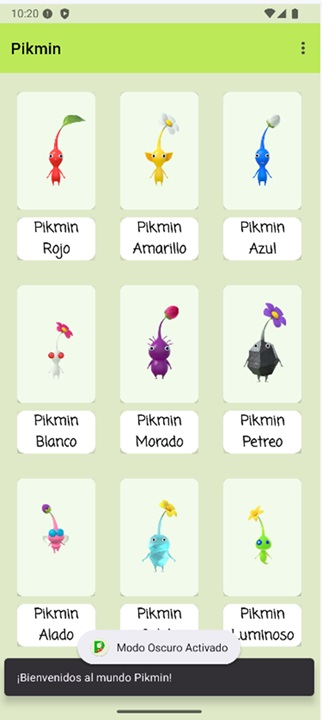
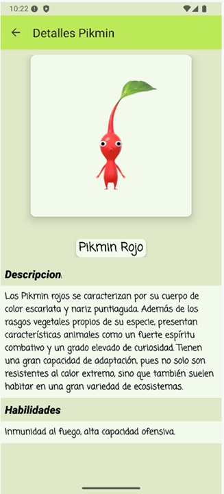
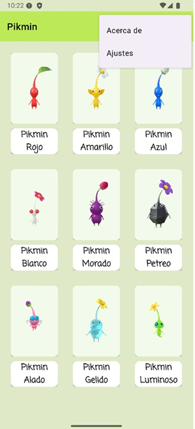
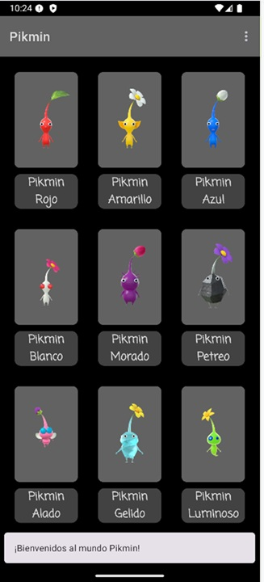
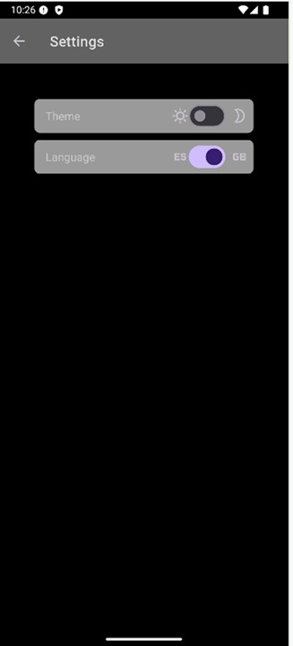
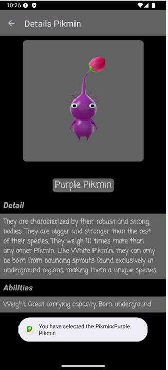

# Pikmin App

Aplicación Android que muestra un listado de los 9 tipos de Pikmin en una cuadrícula, con pantalla de detalle, ajustes de tema e idioma, y soporte multidioma.

##  Capturas de pantalla

## Funcionalidades

### Listado de Pikmin
- RecyclerView con **GridLayoutManager** de 3 columnas
- **CardView** para cada elemento con imagen y nombre
- Toolbar personalizada con título "Pikmin"

### Pantalla de detalle
- Imagen grande del Pikmin seleccionado
- Descripción y habilidades completas
- Toolbar con botón de retroceso

### Temas y estilos
- Estilos personalizados en `styles.xml`
- Colores, tamaños y fuentes centralizados
- Sin atributos de estilo en layouts XML

### Menú contextual
- **"Acerca de"**: Diálogo con información de la app
- **"Ajustes"**: Pantalla para cambiar tema claro/oscuro e idioma

### Soporte multidioma
- Español (`values/strings.xml`)
- Inglés (`values-en/strings.xml`)

### Mensajes al usuario
- **Snackbar** al cargar la lista: "¡Bienvenidos al mundo Pikmin!"
- **Toast** al seleccionar un Pikmin: "Se ha seleccionado el Pikmin [nombre]"

### Pantalla de inicio (Splash)
- Splash 
- Logo personalizado y redirección automática

##  Tecnologías utilizadas

- **Kotlin** - Lenguaje de programación
- **Android SDK** - Desarrollo de la app (API 24 - 36)
- **Material Design 3** - Componentes y estilos
- **ViewBinding** - Acceso seguro a vistas
- **RecyclerView** - Listado en cuadrícula con GridLayoutManager
- **CardView** - Tarjetas para cada Pikmin
- **SharedPreferences** - Persistencia de ajustes (tema e idioma)

## 👨‍💻 Autor

**Abraham C**  
[GitHub](https://github.com/acdezindev) | [LinkedIn](https://www.linkedin.com/in/AbrahamCdev)

